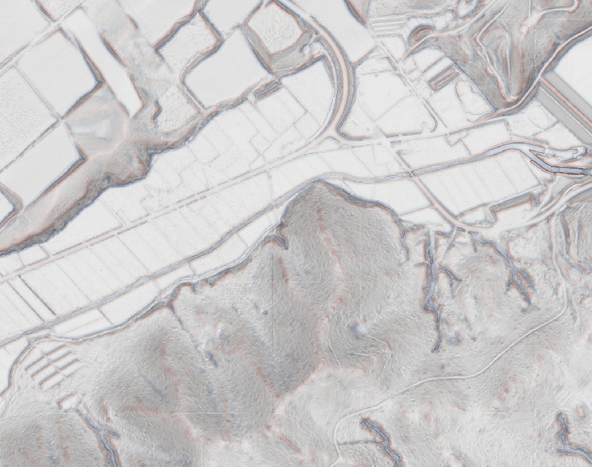
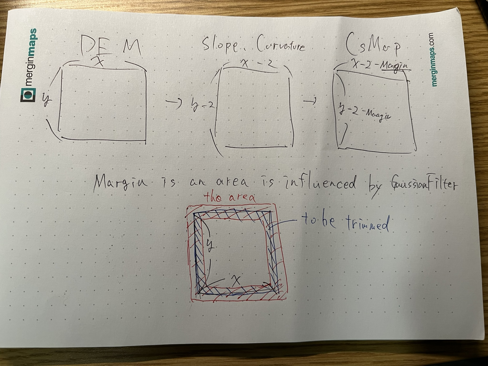

# csmap-py




module to process CSMap, based on <https://www.rinya.maff.go.jp/j/seibi/sagyoudo/attach/pdf/romou-12.pdf>

```planetext
usage: csmap [-h] [--chunk_size CHUNK_SIZE] [--max_workers MAX_WORKERS] [--gf_size GF_SIZE]
                   [--gf_sigma GF_SIGMA] [--curvature_size CURVATURE_SIZE]
                   [--height_scale HEIGHT_SCALE HEIGHT_SCALE]
                   [--slope_scale SLOPE_SCALE SLOPE_SCALE]
                   [--curvature_scale CURVATURE_SCALE CURVATURE_SCALE]
                   input_dem_path output_path

positional arguments:
  input_dem_path        input DEM path
  output_path           output path

options:
  -h, --help            show this help message and exit
  --chunk_size CHUNK_SIZE
                        chunk size as pixel, default to 1024
  --max_workers MAX_WORKERS
                        max workers for multiprocessing, default to 1
  --gf_size GF_SIZE     gaussian filter size, default to 12
  --gf_sigma GF_SIGMA   gaussian filter sigma, default to 3
  --curvature_size CURVATURE_SIZE
                        curvature filter size, default to 1
  --height_scale HEIGHT_SCALE HEIGHT_SCALE
                        height scale, min max, default to 0.0 1000.0
  --slope_scale SLOPE_SCALE SLOPE_SCALE
                        slope scale, min max, default to 0.0 1.5
  --curvature_scale CURVATURE_SCALE CURVATURE_SCALE
                        curvature scale, min max, default to -0.1 0.1
```

## usage

### Command Line Interface

```sh
pip install csmap-py
```

```sh
csmap dem.tif csmap.tif
csmap dem.vrt csmap.tif # you can use virtual raster or other gdal supported format
csmap dem.tif csmap.tif --chunk_size 256 --max_workers 4 # you can use multiprocessing
csmap dem.tif csmap.tif --gf_size 3 --gf_sigma 1.0 --curvature_size 1 # you can change filter size
csmap dem.tif csmap.tif --height_scale 0 500 --slope_scale 0 1 --curvature_scale -0.2 0.2 # you can change scale
```

### Python API

```python
from csmap.process import process, CsmapParams

params = CsmapParams() # use default params

# convert dem to csmap
process(
    input_dem_path,
    output_path,
    chunk_size=1024,
    params
)
```

## processing image


